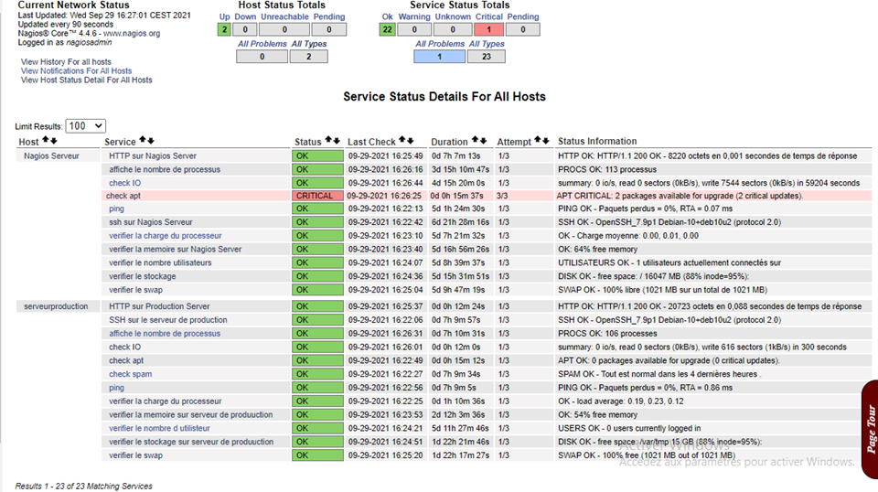

# Supervision de système d’information de mon entreprsie

•	Installation du serveur de supervision Nagios de manière à superviser les serveurs de productions et à se superviser lui-même

•	Création et configuration des sondes et mise en place d’un système d’alerte en cas de dépassement des seuils

•	Centralisation des logs en utilisant le protocole RELP

•	Mise en place d’ une sonde permettant de détecter les spams

**Outils : nagios , python , shell**

<div align="center">
    
</div>

## Présentation et explication des sondes choisis

Les sondes (plugins) vérifient l'état d'une ressource particulière.

Hôtes:
```
0 : hote disponible ( up )
1 , 2: hote indiponible ou unrechable(down)
```

Services:
```
0 : L'état normal (OK)
1 : L'état avertissement (warning)
2 : L'état critique (critical)
3 : L'état inconnu (unknown)
```
### check_ping

permet vérifier si je peux communiquer avec mon serveur de production

check_ping -H $HOSTADDRESS$ -w 40,40% -c 60,60%
```
40 et 60 est le temps de trajet moyen aller-retour (ms) qui déclenche un état AVERTISSEMENT ou CRITIQUE, 
40% et 60% est le pourcentage de perte de paquets pour déclencher un état d'alarme.
```

**Vérifier l’adressage , réseau , routage**

### check_ssh

permet de vérifier si je peux établir une connexion  en ssh avec  mon serveur de production

> check_ssh -H $HOSTADDRESS$

Renvoie CRITICAL si l’Agent ne parvient pas à ouvrir de session SSH. 
Si ce n’est pas le cas, renvoie OK.

**Vérifier que OpenSSH est bien installé et configurer**

### check_http

permet de vérifier la disponibilité de mon site web.

> check_http  -H $HOSTADDRESS$ -w 0,1 -c 0,2 

Temps de réponse pour aboutir à un état d'avertissement (secondes)

**Redémarrer le serveur web**

**Vérifier la configuration du serveur web**

**Vérifier s’il y a un problème de surcharge**

### check_ram.sh

permet de vérifier et de mesurer la quantité de RAM disponible

> check_ram.sh 20 10
```
S’il reste 20 % de la ram libre une alerte d’avertissement s’affiche.
S’il reste 10% de la ram libre une alerte de critique s’affiche
```

**Arrêter des processus** 

**Ajouter de la RAM**

### check_swap

permet de vérifier le swap de la machine.

> check_swap -w 30% -c 20%

Le statut d'AVERTISSEMENT si moins de 30% du swap est libre 
Le statut CRITIQUE si moins de 20% du swap est libre

**Augmenter la taille du swap**

**Si vous constatez un pourcentage élevé d'utilisation du swap, il est temps d'ajouter plus de RAM physique au système Linux.**

### check_disk

permet de vérifier l’espace disque disponible

> check_disk -w 20% -c 10% -p /dev/sda1

L'état d'AVERTISSEMENT si moins de 20% d'espace disque est libre
L'état CRITIQUE si moins de 10% d'espace disque est libre

**Débarrassez-vous des packages qui ne sont plus nécessaires**
**Effacer les journaux du journal systemd**

### check_spam.py

permet de vérifier le nombre de commentaires reçu dans les 4 derniers heures.

> check_spam.py -H 192.168.1.51 -P 3306 -u wordpress_user -p password -d wordpress -w 4 -c 10 -i 4
```
Avertissement, si le nombre de commentaires envoyé dans les 4 dernières heures est 4 ou plus,
Critique, si le nombre de commentaires envoyé dans les 4 dernières heures est 10 ou plus
```
**Bloquer des comptes**
## Centraliser les logs avec Rsyslog
### les logs systèmes : 
#### Coté serveur nagios :
nano /etc/rsyslog.conf

Décommenter ces 2 instructions :
```
module(load="imudp")
input(type="imudp" port="514")
```
Après l’enregistrement redémarrer le service
> Systemctl restart rsyslog

#### Coté serveur de production :
nano /etc/rsyslog.conf

Ajouter cette ligne qui permet d’envoyer tous les logs vers le serveur nagios
```
*.*                             @192.168.1.50:514
```
Après l’enregistrement redémarrer le service

> Systemctl restart rsyslog

Tester le fonctionnement de cette configuration : 

Aller au serveur de centralisation nagios et afficher les fichiers logs

> tail /var/log/auth.log

### les logs du serveur apache
Ajouter dans le fichier   wordpress.conf et 000-default.conf qui se trouvent dans /etc/apache2/sites-available/ les lignes suivantes :
```
ErrorLog "|/usr/bin/logger -t apache -p local6.info"
CustomLog "|/usr/bin/logger -t apache -p local6.info" combined
 LogLevel info
```

Après l’enregistrement redémarrer le service
> Systemctl restart apache2

Tester le fonctionnement de cette configuration : 

Aller au serveur de centralisation nagios et afficher les fichiers logs
> tail /var/log/messages


